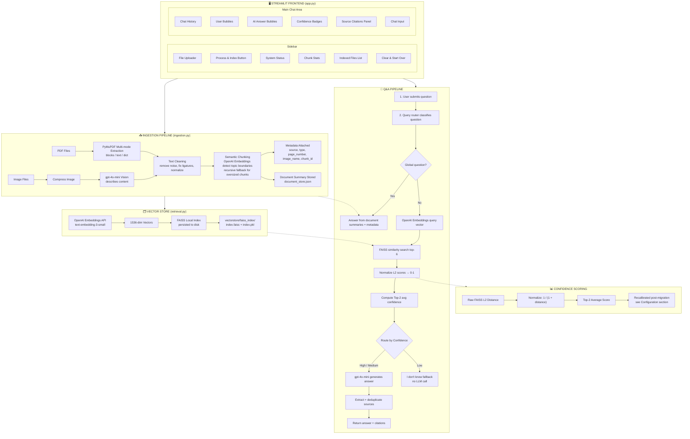

# 📚 RAG Document Q&A System


---

A production-ready **Retrieval-Augmented Generation (RAG)** system that lets you upload PDF documents and images, ask natural language questions, and receive accurate answers with **exact source citations**, **confidence scoring**, and a **smart "I don't know" fallback** to prevent hallucination.

Powered by **OpenAI gpt-4o-mini** for LLM + Vision, **OpenAI text-embedding-3-small** for embeddings, **LangChain Semantic Chunking** for intelligent document splitting, and **FAISS** for fast local vector search.

---

## 📸 Demo Screenshots

> Upload your documents and start asking questions instantly.

| Document Upload | Q&A with Citations |
|---|---|
|  |  |

---

## 🏗️ System Architecture



---

## 🔄 Complete Project Flow

### Step 1 — User Uploads Files
User selects PDFs and/or images via the Streamlit sidebar.

### Step 2 — Files Saved to Disk
`save_uploaded_files()` saves incoming files to `uploads/`.

### Step 3 — Document Ingestion
For each file:

**PDF →**
1. PyMuPDF multi-mode extraction.
2. Text cleaning.
3. Semantic chunking (OpenAI embeddings detect topic boundaries).
4. Recursive fallback for oversized chunks.
5. Metadata attached: `{source, type, page_number, chunk_id}`.
6. Document summary generated and stored in `document_store.json`.

**Image →**
1. Compress to ≤3MB JPEG.
2. gpt-4o-mini Vision API (base64 data URL).
3. Faithful text description extracted.
4. Semantic chunking applied to description.
5. Metadata attached: `{source, type, image_name, chunk_id}`.
6. Summary generated from the description and stored in `document_store.json`.

### Step 4 — Embedding + Vector Store
All chunks → OpenAI Embeddings API (`text-embedding-3-small`) → 1536-dim vectors → FAISS index built → saved to `vectorstore/faiss_index/`.

### Step 5 — User Asks a Question
User types a question in the Streamlit chat input.

### Step 6 — Question Routing
The app first classifies the question:
- **Global/document-level questions** like “what is this about?”, “summarize this pdf”, or “how many pages?” go to the summary/metadata path.
- **Specific factual questions** go to semantic retrieval.

### Step 7 — Semantic Retrieval
For specific questions, the question → OpenAI embeddings → FAISS `similarity_search_with_score(query, k=6)` → top-6 chunks + L2 distances.

### Step 8 — Confidence Scoring
For each score:
normalized = 1 / (1 + L2_distance)
top2_avg = average of top 2 normalized scores
- `top2_avg ≥ CONFIDENCE_HIGH` → 🟢 **High** → proceed to LLM.
- `top2_avg ≥ CONFIDENCE_MEDIUM` → 🟡 **Medium** → proceed to LLM.
- `top2_avg < CONFIDENCE_MEDIUM` → 🔴 **Low** → trigger fallback.

### Step 9 — Answer Generation
1. Retrieved chunks → `format_context()`.
2. Source labels attached: `[Source N: file.pdf | Page X]`.
3. Strict system prompt injected.
4. gpt-4o-mini generates the answer.
5. `is_fallback_response()` checks for a genuine "I don't know".

### Step 10 — Response Displayed
- Answer text in chat bubble.
- Confidence badge (🟢 High / 🟡 Medium / 🔴 Low).
- Sources panel (filename + page number / image).
- Fallback badge, if triggered.

---

## ✨ Features

### Core RAG Features
- 📄 **PDF Ingestion** — Multi-mode extraction (blocks, text, dict) handles columns, tables, complex layouts.
- 🖼️ **Image Understanding** — gpt-4o-mini Vision reads text, charts, diagrams, and tables from images.
- 🧠 **Semantic Chunking** — OpenAI embeddings detect topic boundaries for intelligent splitting.
- 🔍 **FAISS Vector Search** — Local, persistent vector store with fast similarity search.
- 📊 **Confidence Scoring** — Every answer scored High / Medium / Low based on retrieval similarity.
- 🚫 **Hallucination Prevention** — Strict prompt engineering + Low confidence fallback.
- 📚 **Source Citations** — Every claim cited with exact filename and page number.
- 💾 **Persistent Index** — Vector store saved to disk, no re-embedding on restart.
- 🔄 **Multi-file Support** — Query across multiple PDFs and images simultaneously.
- 🧾 **Document Summaries** — Global document questions answered from stored summaries and metadata.

### UI Features
- 🌑 **Dark Theme** — GitHub-inspired dark color palette.
- 💬 **Chat Interface** — Streamlit native chat with styled bubbles.
- 🎨 **Color-coded Badges** — Green / Yellow / Red confidence indicators.
- 📂 **File Status Panel** — Shows indexed files, chunk counts, system status.
- 📈 **Chunk Statistics** — Total / PDF / Image chunk counts displayed.
- 🗑️ **Reset Button** — Clear everything and start fresh.

---

## 🛠️ Tech Stack

| Component | Technology | Purpose |
|---|---|---|
| **Frontend** | Streamlit 1.35 | Chat UI, file upload, display |
| **LLM** | OpenAI gpt-4o-mini | Answer generation |
| **Vision** | OpenAI gpt-4o-mini | Image content extraction |
| **Embeddings** | OpenAI Embeddings API | Text vectorization |
| **Embedding Model** | text-embedding-3-small | 1536-dim semantic vectors |
| **Semantic Chunking** | LangChain SemanticChunker | Topic-aware document splitting |
| **Vector Store** | FAISS (local) | Fast similarity search |
| **PDF Extraction** | PyMuPDF (fitz) | Multi-mode text extraction |
| **Image Processing** | Pillow | Compression before Vision API |
| **RAG Framework** | LangChain 0.2 + langchain-openai | Pipeline orchestration |
| **Metadata Store** | JSON file | File-level summaries and document stats |
| **Environment** | python-dotenv | Secure API key management |

---

## 📁 Project Structure

```text
rag-document-qa/
│
├── app.py                  # Streamlit frontend — chat UI, routing, sidebar
├── ingestion.py             # Document ingestion — PDF extraction + OpenAI vision + semantic chunking + summaries
├── retrieval.py             # Vector store — OpenAI embeddings, FAISS, confidence scoring
├── generation.py            # Answer generation — OpenAI LLM, prompt engineering, citations
├── config.py                # Central config — paths, models, thresholds, chunking params
├── document_store.py        # Summary + metadata store per document
│
├── uploads/                 # Temporary uploaded files (git-ignored)
├── vectorstore/             # Persistent FAISS index (git-ignored)
│   └── faiss_index/
│       ├── index.faiss
│       └── index.pkl
│
├── utils/
│   └── __init__.py
│
├── .env                     # API key (git-ignored — never commit)
├── .gitignore               # Git ignore rules
├── requirements.txt         # All Python dependencies
└── README.md                # This file
```

---

## 🚀 Setup & Installation

### Prerequisites
- Python 3.10 or higher.
- An OpenAI API key.
- Git installed.

### 1. Clone the Repository

```bash
git clone https://github.com/Aliraza-Amjad-Shaikh/rag-document-qa.git
cd rag-document-qa
```

### 2. Create Virtual Environment

```bash
# Mac/Linux
python3 -m venv venv
source venv/bin/activate

# Windows
python -m venv venv
venv\Scripts\activate
```

### 3. Install Dependencies

```bash
pip install -r requirements.txt
```

### 4. Get Your API Key

**OpenAI API Key:**
1. Go to [https://platform.openai.com/api-keys](https://platform.openai.com/api-keys)
2. Click **Create new secret key**.
3. Copy the key (starts with `sk-`).
4. Note: OpenAI API usage is billed — gpt-4o-mini and text-embedding-3-small are both low-cost, but this is not a free tier.

### 5. Configure Environment

Create a `.env` file in the project root:

```env
OPENAI_API_KEY=your-openai-api-key-here
```

### 6. Run the Application

```bash
streamlit run app.py
```

The app opens automatically at `http://localhost:8501`.

---

## 💡 How to Use

### Step 1: Upload Documents
- Click the file uploader in the sidebar.
- Select one or more **PDF files** and/or **images** (JPG, PNG, WEBP).
- Click **🚀 Process & Index Documents**.
- Wait for indexing to complete.

### Step 2: Ask Questions
- Type your question in the chat input at the bottom.
- Press **Enter** to submit.

### Step 3: Read the Answer
- Answer appears with full source citations.
- Confidence badge shows 🟢 High / 🟡 Medium / 🔴 Low.
- Sources panel shows exact filename and page number.

### Step 4: Reset When Done
- Click **🗑️ Clear & Start Over** in the sidebar to upload new documents.

---

## ⚙️ Configuration Reference

All settings are centralized in `config.py`.

### Model Settings

| Setting | Value | Description |
|---|---|---|
| `VISION_MODEL` | `gpt-4o-mini` | OpenAI model for image understanding |
| `CHAT_MODEL` | `gpt-4o-mini` | OpenAI model for answer generation |
| `EMBEDDING_MODEL` | `text-embedding-3-small` | OpenAI model for vector embeddings (1536-dim) |

### Chunking Settings

| Setting | Default | Description |
|---|---|---|
| `CHUNK_SIZE` | `1000` | Max characters for recursive fallback splits |
| `CHUNK_OVERLAP` | `150` | Overlap between fallback chunks |
| `SEMANTIC_BREAKPOINT_TYPE` | `percentile` | Strategy for detecting topic boundaries |
| `SEMANTIC_BREAKPOINT_THRESHOLD` | `85` | Sensitivity of semantic splits (higher = fewer, larger chunks) |
| `MAX_SEMANTIC_CHUNK_SIZE` | `1500` | Hard cap before recursive fallback triggers |
| `MIN_SEMANTIC_CHUNK_SIZE` | `50` | Minimum size — smaller chunks are dropped |

### Retrieval Settings

| Setting | Default | Description |
|---|---|---|
| `TOP_K_RESULTS` | `6` | Number of chunks retrieved per query |
| `CONFIDENCE_HIGH` | `0.60` | Threshold for High confidence — re-tune after migration |
| `CONFIDENCE_MEDIUM` | `0.40` | Threshold for Medium confidence — re-tune after migration |

> **Migration note:** These thresholds were calibrated for the OpenAI embeddings setup. If you change the embedding model again, rebuild the FAISS index and re-tune the confidence thresholds before trusting them in production.

---

## 🔬 How Semantic Chunking Works

Traditional character-based chunking splits text every N characters regardless of meaning:

❌ Character Chunking:

```text
"Machine learning is a subset of AI. It learns from da"
"ta automatically without being explicitly programmed."
```

Semantic chunking uses embeddings to detect where the **meaning changes**:

✅ Semantic Chunking:

```text
Chunk 1: "Machine learning is a subset of AI that learns
from data automatically." ← complete thought

Chunk 2: "Supervised learning uses labeled input-output
pairs to train a model." ← new topic, new chunk
```

**Process:**
1. Every sentence is embedded into a vector.
2. Cosine similarity is measured between consecutive sentences.
3. Large similarity drops = topic boundary = split point.
4. Oversized chunks are split further with recursive character splitting.
5. Undersized chunks (< 50 chars) are dropped as noise.

---

## 🔬 How Confidence Scoring Works

```text
FAISS returns L2 distance (lower = more similar)
              ↓
Normalize: similarity = 1 / (1 + L2_distance)
              ↓
Take average of top-2 scores (more stable than best-only)
              ↓
┌────────────────────────────────────────────┐
│ top2_avg ≥ 0.60 → 🟢 High Confidence      │
│                   → LLM generates answer   │
│                                            │
│ top2_avg ≥ 0.40 → 🟡 Medium Confidence    │
│                   → LLM generates answer   │
│                                            │
│ top2_avg < 0.40 → 🔴 Low Confidence       │
│                   → Fallback triggered     │
│                   → LLM NOT called         │
│                   → Zero API cost          │
└────────────────────────────────────────────┘
```

---

## ⚠️ Limitations

| Limitation | Details |
|---|---|
| **Scanned PDFs** | PDFs that are scanned images cannot be processed by PyMuPDF. Use image upload instead. |
| **Large Documents** | Very large PDFs take significant time and cost to embed. Semantic chunking adds extra OpenAI Embeddings API calls per sentence. |
| **No Conversation Memory** | Each question is answered independently — no multi-turn context. |
| **No Document Summary** | Summary mode is limited to stored per-file summaries, not full multi-turn summarization. |
| **Image Size Limit** | Images compressed to ≤3MB before Vision API. Very small or blurry images may produce poor descriptions. |
| **English Primary** | Best performance on English documents. Other languages may work but are untested. |
| **API Dependency** | Requires an active OpenAI API key with available billing/credits. Offline use not supported. |
| **API Costs** | Embedding, chat, and vision calls all incur OpenAI usage costs. |
| **Confidence Threshold Drift** | Thresholds must be re-tuned if the embedding model changes again. |

---

## 🔮 Planned Improvements

- [ ] Conversation memory (sliding window, last 5 turns)
- [ ] Budget-aware document summarization improvements
- [ ] DOCX / PPTX / CSV / Excel / TXT file support
- [ ] Scanned PDF support via Tesseract OCR
- [ ] Chat history export (PDF / TXT)
- [ ] Document preview in sidebar
- [ ] Multi-session persistence (save session state to JSON)
- [ ] Streamlit Cloud deployment (secrets-based API key handling)
- [ ] Docker containerization
- [ ] HyDE (Hypothetical Document Embeddings) for better retrieval

---

## 📄 License

MIT License

Copyright (c) 2024 Aliraza Amjad Shaikh

Permission is hereby granted, free of charge, to any person obtaining a copy of this software and associated documentation files (the "Software"), to deal in the Software without restriction, including without limitation the rights to use, copy, modify, merge, publish, distribute, sublicense, and/or sell copies of the Software, and to permit persons to whom the Software is furnished to do so, subject to the following conditions:

The above copyright notice and this permission notice shall be included in all copies or substantial portions of the Software.

THE SOFTWARE IS PROVIDED "AS IS", WITHOUT WARRANTY OF ANY KIND, EXPRESS OR IMPLIED, INCLUDING BUT NOT LIMITED TO THE WARRANTIES OF MERCHANTABILITY, FITNESS FOR A PARTICULAR PURPOSE AND NONINFRINGEMENT.

---

## 🙏 Acknowledgements

- [LangChain](https://github.com/langchain-ai/langchain) — RAG orchestration and semantic chunking
- [OpenAI](https://platform.openai.com/) — LLM, Vision, and Embeddings API
- [FAISS](https://github.com/facebookresearch/faiss) — Facebook AI Similarity Search
- [PyMuPDF](https://pymupdf.readthedocs.io/) — PDF text extraction
- [Streamlit](https://streamlit.io) — Frontend framework

---

<p align="center">
  Built with ❤️ by Aliraza Amjad Shaikh using LangChain · OpenAI · FAISS · Streamlit
</p>
<p align="center">
  <a href="https://github.com/Aliraza-Amjad-Shaikh/rag-document-qa">
    ⭐ Star this repo if you found it useful!
  </a>
</p>
