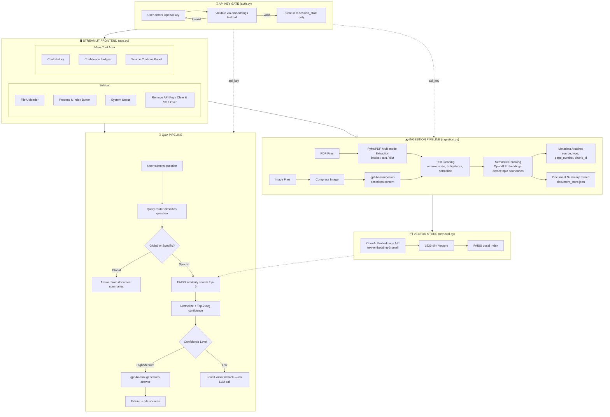

# 📚 RAG Document Q&A System


**🔗 Live App:** [rag-document-app.streamlit.app](https://rag-document-app-mu9lvmoszw2dzb3w5mlntm.streamlit.app/)

---

A production-style **Retrieval-Augmented Generation (RAG)** system that lets you upload PDF documents and images, ask natural language questions, and receive accurate answers with **exact source citations**, **confidence scoring**, and a **smart "I don't know" fallback** to prevent hallucination.

Every user supplies their **own OpenAI API key at runtime** — the app never stores, ships, or reuses a shared key, making it safe to deploy publicly with zero backend cost or liability to the developer.

---

## 🎯 Why This Project Exists

Most RAG tutorials stop at "upload a PDF, ask a question, get an answer." This project was built to go further and answer the questions a real production system has to answer:

- What happens when the retrieved context is irrelevant? (→ confidence scoring + fallback)
- What happens when a user asks about the *document as a whole* instead of a specific fact? (→ query routing)
- What happens when a PDF has multi-column layouts, tables, or is actually a scanned image? (→ multi-strategy extraction)
- How do you deploy an LLM app publicly **without** exposing your own API key or paying for every visitor's usage? (→ mandatory runtime key entry)
- What happens when the underlying LLM/embedding provider changes? (→ documented migration from Gemini + HuggingFace to OpenAI)

This README documents not just *what* the system does, but *why* each decision was made and what broke along the way.

---

## 🏗️ System Architecture



---

## 🧠 Core Design Decisions (and Why)

| Decision | Why |
|---|---|
| **Semantic chunking over fixed-size chunking** | Character-based splitting cuts text mid-sentence or mid-topic, hurting retrieval precision. Semantic chunking embeds every sentence, measures similarity drops between consecutive sentences, and splits at genuine topic boundaries — producing chunks that represent complete ideas. |
| **Top-2 average confidence, not best-score-only** | A single best match can look deceptively strong even when the rest of the retrieved context is irrelevant. Averaging the top 2 normalized scores gives a more stable signal before deciding whether to trust the LLM's answer. |
| **Fallback before calling the LLM** | When confidence is Low, the app returns "I don't know" *without* calling the chat model at all — this avoids paying for a generation call on a question the system already knows it can't answer well, and it's the single biggest anti-hallucination guardrail in the system. |
| **Temperature = 0 on the LLM** | Zero temperature makes answers deterministic and strictly grounded in the retrieved context, minimizing creative drift that leads to fabricated claims. |
| **Exact-phrase fallback detection, not substring matching** | An early version checked `"i don't know" in answer.lower()`, which caused false positives whenever the model wrote something like *"I don't know if this is exhaustive, but..."* inside an otherwise valid answer. Fixed with an exact-phrase match against a fixed fallback vocabulary. |
| **Multi-strategy PDF extraction (blocks → text → dict)** | A single PyMuPDF extraction mode fails on many real-world PDFs — multi-column layouts, embedded tables, or unusual encodings. Cascading through three strategies (in order of quality) covers the vast majority of real documents without manual intervention per file. |
| **Image compression before Vision API calls** | Uncompressed images can exceed API payload limits and silently fail or time out. Images are resized to a max dimension and iteratively JPEG-compressed until they're reliably under the API's practical size ceiling. |
| **Document-level summaries stored separately from chunks** | "What is this document about?" is a fundamentally different question from "What does page 4 say about X?" A dedicated `document_store.json` holds a short LLM-generated summary per file, so global/overview questions don't have to guess from arbitrary retrieved chunks. |
| **Query routing (global vs. specific)** | Without routing, "summarize this document" would go through the same top-6 similarity search as a factual lookup — and often retrieve unrelated fragments. A lightweight pattern classifier detects overview-style phrasing and routes it to the summary store instead. |
| **Runtime-only API key, never `.env` in production** | This is the most significant architectural decision in the project (see dedicated section below). |

---

## 🔄 Migration History: From Gemini + HuggingFace to OpenAI

The project was **not built on OpenAI from day one**. Understanding the migration explains several design choices still visible in the codebase.

### Original stack (v1)

| Component | Original Choice |
|---|---|
| LLM | Google Gemini 2.5 Flash |
| Vision | Google Gemini 2.5 Flash Vision |
| Embeddings | HuggingFace Inference API — `sentence-transformers/all-MiniLM-L6-v2` (384-dim) |
| Confidence thresholds | High = 0.80, Medium = 0.50 (calibrated for MiniLM's similarity distribution) |
| API keys required | Google API key + HuggingFace token |

### Why it was migrated to OpenAI

- **Single-provider simplicity**: one API key instead of two, one billing relationship, one set of rate limits to reason about.
- **Vision quality**: `gpt-4o-mini` Vision proved more reliable for structured content extraction (tables, charts, diagrams) than the free-tier HuggingFace embedding pipeline paired with Gemini Vision.
- **Consistency between chunking and retrieval embeddings**: using the same OpenAI embedding model for semantic chunking *and* FAISS retrieval avoids subtle mismatches between how chunks were split and how they're later searched.

### What broke during migration

Switching from 384-dimensional MiniLM vectors to 1536-dimensional `text-embedding-3-small` vectors **invalidated the old confidence thresholds**. MiniLM and OpenAI embeddings produce similarity scores with different distributions, so a threshold of 0.80 that made sense for MiniLM was miscalibrated for OpenAI's embedding space. This required:

1. Rebuilding the FAISS index from scratch (old vectors were incompatible with the new embedding dimensionality).
2. Re-running sample queries to observe the new score distribution.
3. Re-tuning `CONFIDENCE_HIGH` and `CONFIDENCE_MEDIUM` in `config.py`.
4. **Catching and fixing an ordering bug** introduced during re-tuning: the thresholds were briefly set as `CONFIDENCE_HIGH = 0.45` and `CONFIDENCE_MEDIUM = 0.55` — since the code checks the High condition first, any score above 0.55 already satisfied `>= CONFIDENCE_HIGH`, making the Medium tier mathematically unreachable. Fixed by ensuring `CONFIDENCE_MEDIUM < CONFIDENCE_HIGH`.

This is a good illustration of a real production RAG failure mode: **changing the embedding model silently breaks calibrated thresholds**, and it's easy to introduce an off-by-comparison bug while fixing it under time pressure.

---

## 🔐 Security Redesign: Mandatory Runtime API Key

This is the most deliberate architectural decision in the project, built specifically to make **public deployment safe**.

### The problem with the naive approach

Most tutorial RAG apps read `OPENAI_API_KEY` from a `.env` file via `python-dotenv` and call it done. That works for local development but is dangerous to deploy publicly:

- If deployed with the developer's own key baked into platform secrets, **every visitor's usage is billed to the developer** — a single bad actor or viral link could generate an unbounded bill.
- `.env` files are notoriously easy to accidentally commit to Git, permanently leaking the key into repository history.

### The chosen design

Instead of a local-vs-online mode toggle, the app enforces **one rule, unconditionally**: every fresh session must provide a valid OpenAI API key before any part of the RAG pipeline runs — whether the app is running on `localhost` or on the deployed Streamlit Cloud URL.

**Flow:**

1. On load, the app shows only an API-key entry screen — no file upload, no chat input, nothing else is rendered.
2. The key is validated with a minimal live request to the OpenAI Embeddings API (not just a format check — a real credential + connectivity check).
3. On success, the key is stored **only** in `st.session_state` for that browser session — never written to disk, `.env`, `document_store.json`, FAISS metadata, or logs.
4. The validated key is then threaded explicitly as a function parameter through every OpenAI-dependent call: semantic chunking, document summarization, image Vision calls, embedding generation, FAISS build/load, and final answer generation.
5. A "Remove API Key" action clears the session key and immediately re-locks the app.
6. Restarting the app (or opening a new session) always re-triggers the key gate — there is no persistent bypass.

### Why this matters for the deployed app

Since the app is now live on Streamlit Community Cloud, **each visitor pays for their own usage with their own key**. The developer's OpenAI account is never touched by public traffic. This also means the app's cost to operate is effectively zero regardless of visitor count.

### Trade-off accepted

The user must re-enter their key every session — there's no "remember me" convenience. This was a deliberate choice: session-only key storage is what makes public deployment safe, and the alternative (persisting keys anywhere) reintroduces the exact risk this design avoids.

---

## 🐛 Real Bugs Encountered and Fixed

| Bug | Root Cause | Fix |
|---|---|---|
| **Stale answers after uploading a new document** | `document_store.json` persists on disk independently of Streamlit session state. Because the app now resets its session on every run (API key gate), `st.session_state.indexed_files` was empty on each fresh run, so the "replace existing file" check silently failed and old summaries kept accumulating — meaning "what is this document about?" could return a stale summary from a completely different file uploaded in an earlier session. | Added `clear_document_store()` to wipe `document_store.json` on "Clear & Start Over," and changed the replace-detection logic to check the on-disk store (`load_document_store()`) instead of the ephemeral session list. |
| **Confidence "Medium" tier unreachable** | During re-calibration after the OpenAI migration, `CONFIDENCE_HIGH` and `CONFIDENCE_MEDIUM` were set in the wrong relative order, so the `>= CONFIDENCE_HIGH` check always short-circuited before Medium could ever be evaluated. | Corrected the ordering so `CONFIDENCE_MEDIUM < CONFIDENCE_HIGH`, restoring the intended three-tier behavior. |
| **`UndefinedVariable` errors while adding the runtime API key** | Adding `api_key` to `get_semantic_chunker()` alone wasn't sufficient — the parameter has to exist in the signature of **every function in the call chain** (`ingest_documents` → `ingest_pdf`/`ingest_image` → `semantic_chunk_text` → `get_semantic_chunker`), since Python functions don't inherit variables from callers' scopes. | Threaded `api_key` explicitly through every function signature in the ingestion, retrieval, and generation call chains. |
| **Image chunks never appearing in the vector store (earlier version)** | `get_or_build_vectorstore()` defaulted to loading the existing index even when new documents were passed, so newly ingested image chunks were silently dropped. | Fixed to always rebuild fresh when new documents are explicitly provided. |
| **FAISS index failing to reload after saving** | FAISS saves as a subfolder (`faiss_index/index.faiss`), not a flat file (`faiss_index.faiss`) — the load check was looking for the wrong path. | Corrected the existence check to look inside the subfolder. |
| **Vision API silently failing on large images** | Images were sent to the Vision API uncompressed; large base64 payloads caused timeouts or empty responses. | Added iterative compression (resize + JPEG quality reduction) before every Vision API call. |

---

## ✨ Features

### Core RAG Capabilities
- 📄 **PDF Ingestion** — multi-mode extraction (blocks, text, dict) handles columns, tables, and complex layouts.
- 🖼️ **Image Understanding** — `gpt-4o-mini` Vision reads text, charts, diagrams, and tables from images.
- 🧠 **Semantic Chunking** — OpenAI embeddings detect topic boundaries for intelligent splitting, with recursive fallback for oversized chunks.
- 🔍 **FAISS Vector Search** — fast local similarity search over 1536-dimensional embeddings.
- 📊 **Confidence Scoring** — every answer labeled High / Medium / Low based on retrieval similarity.
- 🚫 **Hallucination Prevention** — strict system prompt + Low-confidence fallback that skips the LLM call entirely.
- 📚 **Exact Source Citations** — every claim cited with filename and page number (or image name).
- 🧾 **Document Summaries** — global/overview questions answered from a dedicated summary store, not raw chunk search.
- 🔀 **Query Routing** — automatically classifies "about this document" questions vs. specific factual lookups.
- 🔄 **Multi-file Support** — query across multiple PDFs and images simultaneously.

### Security & Access
- 🔐 **Mandatory runtime API key** — every session requires the user's own OpenAI key; never a shared or hardcoded credential.
- ✅ **Live key validation** — a real API call confirms the key works before unlocking the app.
- 🔒 **Session-only key storage** — never written to disk, environment files, or version control.
- 🚪 **Lock/Remove Key action** — instantly re-locks the app without restarting the process.

### UI
- 🌑 Dark theme, native Streamlit chat interface.
- 🎨 Color-coded confidence badges (🟢 / 🟡 / 🔴).
- 📂 Indexed file panel with chunk statistics.
- 🗑️ One-click reset for documents and vector store.

---

## 🛠️ Tech Stack

| Component | Technology | Purpose |
|---|---|---|
| **Frontend** | Streamlit | Chat UI, file upload, session-based key gate |
| **LLM** | OpenAI `gpt-4o-mini` | Answer generation, document summarization |
| **Vision** | OpenAI `gpt-4o-mini` (Vision) | Image content extraction |
| **Embeddings** | OpenAI `text-embedding-3-small` | 1536-dim semantic vectors for chunking and retrieval |
| **Semantic Chunking** | LangChain `SemanticChunker` | Topic-aware document splitting |
| **Vector Store** | FAISS (local, CPU) | Fast similarity search, persisted to disk |
| **PDF Extraction** | PyMuPDF (`fitz`) | Multi-strategy text extraction |
| **Image Processing** | Pillow | Compression before Vision API calls |
| **RAG Orchestration** | LangChain + `langchain-openai` | Pipeline wiring across ingestion/retrieval/generation |
| **Metadata Store** | JSON (`document_store.json`) | Per-document summaries and stats |
| **Deployment** | Streamlit Community Cloud | Free, GitHub-connected hosting |

---

## 📁 Project Structure

```text
rag-document-qa/
│
├── app.py                  # Streamlit frontend — API key gate, chat UI, routing, sidebar
├── auth.py                 # Runtime API key validation (live OpenAI check, no persistence)
├── ingestion.py             # PDF extraction + OpenAI Vision + semantic chunking + summaries
├── retrieval.py             # FAISS vector store, embeddings, confidence scoring, query routing
├── generation.py            # OpenAI LLM calls, prompt engineering, citations, fallback detection
├── config.py                # Central config — paths, models, thresholds, chunking params
├── document_store.py        # Per-document summary + metadata persistence
│
├── uploads/                 # Temporary uploaded files (git-ignored, ephemeral on cloud)
├── vectorstore/             # Persistent FAISS index (git-ignored, ephemeral on cloud)
│   └── faiss_index/
│       ├── index.faiss
│       └── index.pkl
│
├── .streamlit/
│   └── config.toml          # Production server settings
│
├── .gitignore
├── requirements.txt
└── README.md
```

---

## 🚀 Live Deployment

**Platform:** Streamlit Community Cloud
**URL:** [https://rag-document-app-mu9lvmoszw2dzb3w5mlntm.streamlit.app/](https://rag-document-app-mu9lvmoszw2dzb3w5mlntm.streamlit.app/)

### How deployment works

1. The app is connected directly to this GitHub repository — every push to the main branch triggers an automatic redeploy.
2. No platform secrets are configured for the OpenAI key, by design — the mandatory runtime key gate means each visitor authenticates with their own credentials.
3. Each visitor gets an isolated Streamlit session; API keys, chat history, and uploaded documents are never shared across users.

### Known limitation of the current deployment

Streamlit Community Cloud's filesystem is **ephemeral** — anything written to disk (`uploads/`, `vectorstore/faiss_index/`, `document_store.json`) does not persist across app restarts, redeploys, or sleep/wake cycles from inactivity. This means:

- Documents must be re-uploaded and re-indexed at the start of each fresh session.
- This is consistent with the app's security model (nothing persists that shouldn't), but it does mean there is no "come back tomorrow and keep chatting with your documents" experience yet.

A future migration to a host with persistent disks (or Docker on a VM with a mounted volume) would resolve this — tracked in Planned Improvements below.

---

## 💻 Local Setup

### Prerequisites
- Python 3.10 or higher
- An OpenAI API key ([platform.openai.com/api-keys](https://platform.openai.com/api-keys))
- Git

### Steps

```bash
git clone https://github.com/Aliraza-Amjad-Shaikh/rag-document-qa.git
cd rag-document-qa

python -m venv venv
source venv/bin/activate   # Windows: venv\Scripts\activate

pip install -r requirements.txt

streamlit run app.py
```

The app opens at `http://localhost:8501` — you will be prompted to enter your OpenAI API key immediately, exactly as in the deployed version. There is no `.env`-based shortcut; this is intentional so local behavior always matches production behavior.

---

## 💡 How to Use

1. **Enter your OpenAI API key** on the initial screen and validate it.
2. **Upload documents** — PDFs and/or images (JPG, PNG, WEBP) via the sidebar.
3. **Click "Process & Index"** — wait for extraction, chunking, embedding, and summary generation to complete.
4. **Ask questions** in the chat — try both:
   - A specific factual question (routes to semantic retrieval).
   - "What is this document about?" (routes to the summary store).
5. **Read the answer** with its confidence badge and source citations.
6. **Clear & Start Over** to reset documents, or **Remove API Key** to lock the app again.

---

## 🔬 How Semantic Chunking Works

```text
❌ Character Chunking (naive):
"Machine learning is a subset of AI. It learns from da"
"ta automatically without being explicitly programmed."   ← cut mid-word

✅ Semantic Chunking (this project):
Chunk 1: "Machine learning is a subset of AI that learns
          from data automatically." ← complete thought

Chunk 2: "Supervised learning uses labeled input-output
          pairs to train a model." ← new topic, new chunk
```

**Process:**
1. Every sentence is embedded via the OpenAI Embeddings API.
2. Cosine similarity is measured between consecutive sentence embeddings.
3. A large similarity drop marks a topic boundary → split point.
4. Oversized resulting chunks are split further with a recursive character splitter.
5. Undersized chunks (below a minimum character threshold) are dropped as noise.

---

## 🔬 How Confidence Scoring Works

```text
FAISS returns L2 distance (lower = more similar)
              ↓
Normalize: similarity = 1 / (1 + L2_distance)
              ↓
Take the average of the top-2 scores (more stable than best-score-only)
              ↓
┌────────────────────────────────────────────┐
│ top2_avg ≥ CONFIDENCE_HIGH   → 🟢 High     │
│                               → LLM answers │
│                                              │
│ top2_avg ≥ CONFIDENCE_MEDIUM → 🟡 Medium   │
│                               → LLM answers │
│                                              │
│ top2_avg < CONFIDENCE_MEDIUM → 🔴 Low      │
│                               → Fallback    │
│                               → No LLM call │
│                               → Zero cost   │
└────────────────────────────────────────────┘
```

Thresholds are centralized in `config.py` and must be re-tuned any time the embedding model changes, since different embedding models produce different similarity score distributions.

---

## ⚠️ Limitations

| Limitation | Details |
|---|---|
| **Ephemeral storage on deployment** | Documents and the FAISS index do not persist across app restarts on Streamlit Community Cloud's free tier. |
| **No conversation memory** | Each question is answered independently — no multi-turn context carried between questions. |
| **Scanned PDFs unsupported** | PyMuPDF requires an embedded text layer; scanned/image-only PDFs return no extractable text (use image upload instead). |
| **API key required every session** | By design — no persistence, no "remember me." |
| **API cost dependency** | Embedding, chat, and vision calls all incur OpenAI usage costs, billed to whichever key the user enters. |
| **English-primary** | Best performance on English documents; other languages are untested. |
| **Large documents are slow to index** | Semantic chunking calls the Embeddings API per sentence, so very large PDFs take longer and cost more to ingest. |
| **Confidence thresholds are embedding-model-specific** | Changing the embedding model again requires rebuilding the index and re-tuning thresholds, as happened during the OpenAI migration. |

---

## 🔮 Planned Improvements

- [ ] Persistent storage (S3 or mounted volume) to survive app restarts on deployment
- [ ] Docker containerization for portable, reproducible deployment
- [ ] Conversation memory (sliding window, last N turns)
- [ ] DOCX / PPTX / CSV / Excel / TXT file support
- [ ] Scanned PDF support via Tesseract OCR
- [ ] Chat history export (PDF / TXT)
- [ ] Document preview in sidebar
- [ ] HyDE (Hypothetical Document Embeddings) for improved retrieval on complex questions
- [ ] Per-file scoping for global/summary questions (currently summarizes across all indexed files)

---

## 🗣️ Anticipated Questions (and Answers)

**Q: Why not just use `.env` for the API key like most tutorials?**
Because this app is publicly deployed. A shared key in `.env`/platform secrets means every visitor's usage bills the developer's account with no cap. Mandatory runtime key entry shifts cost and accountability to each user and removes the developer's OpenAI account from the public attack surface entirely.

**Q: Why FAISS instead of a managed vector database like Pinecone?**
FAISS runs locally with no external service, no additional API key, and no network latency for similarity search — appropriate for a single-user-per-session app where the index is rebuilt or reloaded per session rather than shared across a large user base.

**Q: Why did confidence scoring break after switching embedding providers?**
Different embedding models produce vectors with different geometric properties, so a similarity threshold tuned for one model's distribution doesn't transfer to another. This is a common, easy-to-miss production RAG failure mode — documented above under Migration History.

**Q: How do you prevent hallucination?**
Three layers: (1) a strict system prompt instructing the model to answer only from provided context and cite every claim, (2) exact-phrase fallback detection to catch genuine "I don't know" responses without false positives, and (3) a Low-confidence gate that skips the LLM call entirely when retrieval quality is poor.

**Q: What would you change with more time?**
Persistent storage across sessions (currently the biggest UX gap caused by Streamlit Community Cloud's ephemeral filesystem), conversation memory, and per-file scoping for summary questions so "what is this about?" doesn't blend summaries from unrelated documents in the same session.

---

## 📄 License

MIT License — see full text in the repository.

---

## 🙏 Acknowledgements

- [LangChain](https://github.com/langchain-ai/langchain) — RAG orchestration and semantic chunking
- [OpenAI](https://platform.openai.com/) — LLM, Vision, and Embeddings API
- [FAISS](https://github.com/facebookresearch/faiss) — Facebook AI Similarity Search
- [PyMuPDF](https://pymupdf.readthedocs.io/) — PDF text extraction
- [Streamlit](https://streamlit.io) — Frontend framework and free hosting

---

<p align="center">
  Built by Aliraza Amjad Shaikh using LangChain · OpenAI · FAISS · Streamlit
</p>
<p align="center">
  <a href="https://rag-document-app-mu9lvmoszw2dzb3w5mlntm.streamlit.app/">🚀 Try the live app</a>
</p>
